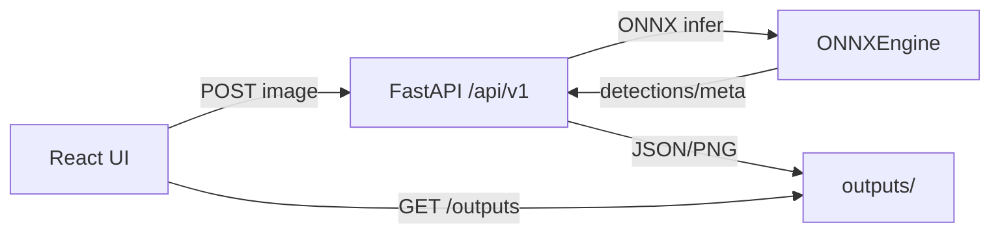

# Архитектура MVP

- Frontend (React/Vite) → API `/api/v1` (FastAPI)
- FastAPI: роуты `/infer`, `/match`, `/config/threshold`, `/bench`
- ONNXEngine (onnxruntime, fixed 2048, letterbox, ROI)
- Хранилище результатов: `outputs/YYYY-MM-DD/HHMMSS_name.json` + `_viz.png`

## Данные/обучение
- tools/ingest_images.py: EXIF, ROI, manifest, split
- tools/convert_labels.py: Label Studio/CVAT → YOLO‑Seg
- tools/verify_annotations.py: визуальная верификация

